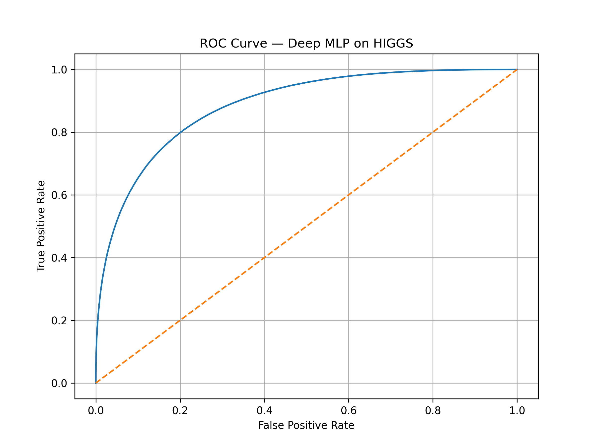

# **Large-Scale ML Modeling on the HIGGS Dataset**

The HIGGS dataset is a simulated particle-physics benchmark containing **11 million collision events**.
Each event is represented by **28 physics features**, and the task is to classify whether it corresponds to a **simulated Higgs boson signal** or **background noise**.

Although the dataset is simulated, the classification problem is genuinely challenging: the numerical features for signal and background events **overlap heavily**, making the decision boundary subtle and fully dependent on statistical patterns.

From a machine-learning perspective, the dataset is valuable because it provides:

* a **large-scale binary classification task** suitable for realistic benchmarking
* moderately imbalanced classes
* high overlap between feature distributions
* a test of model efficiency and scalability on multi-million-row tabular data

This project builds and compares several practical ML pipelines—from tuned tree-based models (LightGBM, XGBoost) to a deep residual MLP—to evaluate what modeling strategies achieve the best performance at scale.

# ⭐ **Results Summary**

| Model                                                 | ROC-AUC     | PR-AUC      | Accuracy    |
| ----------------------------------------------------- | ----------- | ----------- | ----------- |
| **Deep MLP**                                          | **0.88525** | **0.89509** | **0.79986** |
| LightGBM (Tuned with Optuna)                          | 0.85187     | 0.86425     | 0.76760     |
| XGBoost (Tuned with Optuna)                           | 0.84888     | 0.86128     | 0.76466     |
| Top-20 Features + XGBoost                             | 0.84791     | 0.86070     | 0.76413     |
| Autoencoder + LightGBM                                | 0.83908     | 0.85226     | 0.75568     |
| Physics-Engineered Features Model (Tuned with Optuna) | 0.83785     | 0.85069     | 0.75463     |
| Top-20 Features + LightGBM                            | 0.83768     | 0.85112     | 0.75447     |
| LightGBM (Untuned)                                    | 0.83434     | 0.84782     | 0.75130     |
| XGBoost (Untuned)                                     | 0.83000     | 0.84351     | 0.74779     |

# **Dataset Citation**

> [HIGGS - UCI Machine Learning Repository](https://archive.ics.uci.edu/dataset/280/higgs)

# **Introductory Paper**

> Baldi P. et al., “Searching for Exotic Particles in High-Energy Physics with Deep Learning.” 2014.
> [https://arxiv.org/abs/1402.4735](https://arxiv.org/abs/1402.4735)

# **Dataset Overview**

The **HIGGS dataset** contains **11 million simulated proton–proton collision events**, each represented by **28 features** and a **binary label** indicating whether the event corresponds to a Higgs boson decay signal (`1`) or background process (`0`).

### **Feature Types**

* **21 low-level physics features**
* **7 high-level engineered features** derived from particle combinations
* All features are **continuous**
* ROC-AUC remains a reliable primary metric for this dataset because it is insensitive to class imbalance, and HIGGS has only a mild class skew (53% vs 47%).

# **Dataset Construction**

All experiments use a cleaned version of the original `HIGGS.csv`, created by a small preprocessing script. The script is designed to work with the **full 11M rows by default**, but can be configured to produce a smaller subset while preserving the original class distribution by changing `TARGET_ROWS`. It standardizes the column naming, parses the `label` column defensively, uses chunked reading to handle large `TARGET_ROWS` sizes, samples the required number of events per class, restores the original physics feature names, and finally writes the resulting dataset to `HIGGS_short.csv`.

# **Model Comparison**

| Model                               | ROC-AUC | PR-AUC  | Accuracy |
|-------------------------------------|---------|---------|----------|
| LightGBM (Untuned)                  | 0.83434 | 0.84782 | 0.75130  |
| XGBoost (Untuned)                   | 0.83000 | 0.84351 | 0.74779  |
| Autoencoder + LightGBM              | 0.83908 | 0.85226 | 0.75568  |
| Top-20 Features + LightGBM          | 0.83768 | 0.85112 | 0.75447  |
| Top-20 Features + XGBoost           | 0.84791 | 0.86070 | 0.76413  |
| LightGBM (Tuned with Optuna)        | 0.85187 | 0.86425 | 0.76760  |
| XGBoost (Tuned with Optuna)         | 0.84888 | 0.86128 | 0.76466  |
| Physics-Engineered Features Model (Tuned with Optuna)   | 0.83785 | 0.85069| 0.75463  |
| **Deep MLP**                        | **0.88525**   | **0.89509**  | **0.79986**    |

The Deep MLP consistently outperformed all classical ML baselines across ROC-AUC, PR-AUC, and overall accuracy. We use a **70 / 15 / 15 split**, created with `train_test_split` and a **fixed `random_state=42`** to ensure all models are trained and evaluated on the **exact same data partitions**. This guarantees that differences in performance come from the models themselves—not from different data splits.

# **Model Explanation**

* **LightGBM (Untuned)** – Baseline LightGBM classifier using simple, non-tuned parameters (`num_leaves=64`, `learning_rate=0.05`). Serves as a strong first benchmark and provides feature importance rankings used later for subset experiments.

* **XGBoost (Untuned)** – Standard histogram-based XGBoost baseline (`max_depth=6`, `eta=0.05`, `subsample=0.8`, `colsample_bytree=0.8`). Trained for up to 1000 boosting rounds with early stopping.

* **Autoencoder + LightGBM** – A shallow autoencoder (28 → 14 → 8) trained for 20 epochs to learn compressed latent representations. The 8-dimensional embedding is concatenated with the original features and passed to an untuned LightGBM model.

* **Top-20 Features + LightGBM** – LightGBM trained exclusively on the 20 most important physics variables (identified from the baseline model). Useful for testing whether a reduced feature space improves generalization.

* **Top-20 Features + XGBoost** – XGBoost trained on the same reduced feature set, using a deeper tree (`max_depth=8`) and conservative learning rate (`eta=0.05`) to evaluate model behavior on compact input representations.

* **LightGBM (Tuned)** – LightGBM hyperparameters optimized via a lightweight 5-trial Optuna search (tuning `learning_rate`, `num_leaves`, depth, sampling fractions, and regularization). Best configuration trained first with **3000 rounds** during tuning and **5000 rounds** for the final model, using early stopping.

* **XGBoost (Tuned)** – Similar 5-trial Optuna optimization of XGBoost hyperparameters (depth, child weight, sampling rates, L1/L2 regularization). Final model trained with **3000 rounds during tuning** and **5000 rounds for final training**, using `tree_method="hist"`.

* **Physics-Engineered Features + LightGBM** – LightGBM trained on the 28 original variables plus 7 engineered high-level physics features (simple combinations inspired by domain literature). Tuned with a small Optuna search (5 trials) and trained with early stopping.

# **Deep MLP Model**

This section describes the final neural model used in the benchmark — a deep residual MLP designed to train efficiently on the full 11M-row HIGGS dataset.

### ⭐ **Final Test Results (using EMA weights)**

| Metric       | Score       |
| ------------ | ----------- |
| **ROC-AUC**  | **0.88525** |
| **PR-AUC**   | **0.89509** |
| **Accuracy** | **0.79986** |

### **ROC-AUC Curve**



## **Model Architecture**

The network is a deep feed-forward model with residual connections, normalization layers, and gated activations. It is built to be expressive while remaining fast on tabular data.

**Key components:**

* **Input Layer:**
  Linear projection from 28 features → 1536 hidden units, followed by LayerNorm.

* **10 Residual Blocks:**
  Each block includes:

  * LayerNorm
  * A SwiGLU-style gated feed-forward layer
  * A second linear projection
  * A residual connection
  * A learned LayerScale parameter for stable deep training

* **Output Layer:**
  A single linear unit producing the logit for binary classification.

This architecture allows deeper training than a standard MLP while keeping computation lightweight (no attention layers).

## **Training Strategy**

* **Large batch size (8192):**
  Empirically offered the best stability and throughput on this dataset.

* **Mixed Precision (AMP):**
  Used throughout training to reduce memory footprint and speed up training.

* **Optimizer: AdamW:**
  Good performance for deep MLPs and helps regularize high-dimensional layers.

* **Warmup + Cosine Annealing:**

  * 20% warmup to prevent early instability
  * Cosine decay for smoother convergence

* **Early Stopping:**
  Validation ROC-AUC monitored with patience=2 for consistent comparisons across models.

## **EMA Weights**

Training maintained an exponential moving average (EMA) of the model weights:

* Updated every batch
* EMA weights were used for final evaluation
* Raw weights also saved for reproducibility

EMA produced slightly more stable test scores, especially late in training.

## **Reproducibility**

* All models use the **same 70/15/15 split** with `random_state=42`.
* The deep MLP consistently achieves **0.884–0.886 ROC-AUC** across runs.
* EMA further reduces run-to-run variance.

This consistency demonstrates the model’s reliability on large-scale tabular physics data.

# **How to Use This Repository**

### **1. Install dependencies**

```bash
pip install -r requirements.txt
```

### **2. Download the HIGGS Dataset**

Download the original `HIGGS.csv` from the UCI Machine Learning Repository:

🔗 **[https://archive.ics.uci.edu/dataset/280/higgs](https://archive.ics.uci.edu/dataset/280/higgs)**

Place the file in the project root.

### **3. Run Preprocessing**

If you want to train on fewer than 11M rows, open:

```
01_preprocessing.ipynb
```

and modify:

```python
TARGET_ROWS = <desired number>
```

This script generates a proportionally identical downsampled subset of the HIGGS dataset, preserving the original class distribution and save:

```
HIGGS_short.csv
```

If left unchanged, it uses **all 11M rows**.

### **4. Run Any Model Notebook**

Each notebook corresponds to a model evaluated in the study:

```
02_LightGBM_untuned.ipynb
03_XGBoost_untuned.ipynb
04_Autoencoder_LightGBM.ipynb  
05_TopKModel.ipynb 
06_LightGBM_tuned.ipynb 
07_XGBoost_tuned.ipynb
08_Physics_Feature_Engineering_LightGBM_Tuned.ipynb
09_DNN.ipynb
```

Each file trains the corresponding model using the **same train/val/test split (random_state=42)**, ensuring results are directly comparable.

# **Conclusion**

Across all experiments, tree-based models (LightGBM and XGBoost) provided strong baselines on the HIGGS dataset, with tuned versions improving performance modestly over their untuned counterparts. Feature selection and autoencoder-based dimensionality reduction also offered small gains but did not fundamentally outperform the full-feature models.

The **Deep MLP** architecture ultimately achieved the **highest overall performance** among all approaches evaluated, demonstrating that a well-regularized, sufficiently deep neural network can extract meaningful nonlinear structure from the 28 physics features. Its combination of residual SwiGLU blocks, LayerNorm, warmup + cosine learning-rate scheduling, and EMA stabilization allowed it to outperform the tuned gradient-boosted models on all metrics (ROC-AUC, PR-AUC, Accuracy).

Overall, the experiments show that:

* **Boosted trees remain extremely strong baselines** on tabular physics data
* **Feature engineering and embeddings help, but only incrementally**
* **A carefully designed deep network** can surpass classical methods when properly optimized

This exploration provided a clear, reproducible comparison across multiple modeling strategies and helped identify the architecture that achieved the best results on this dataset.